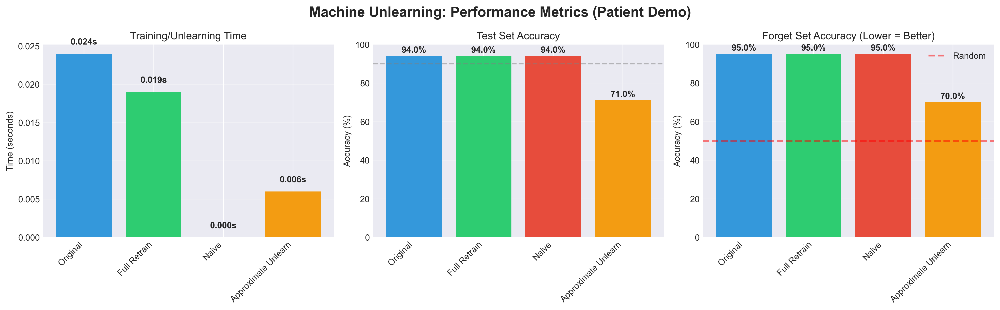
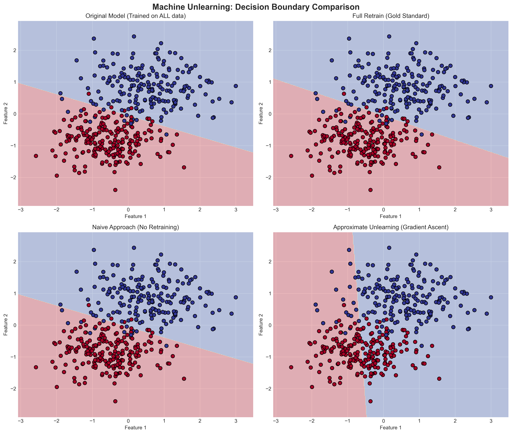
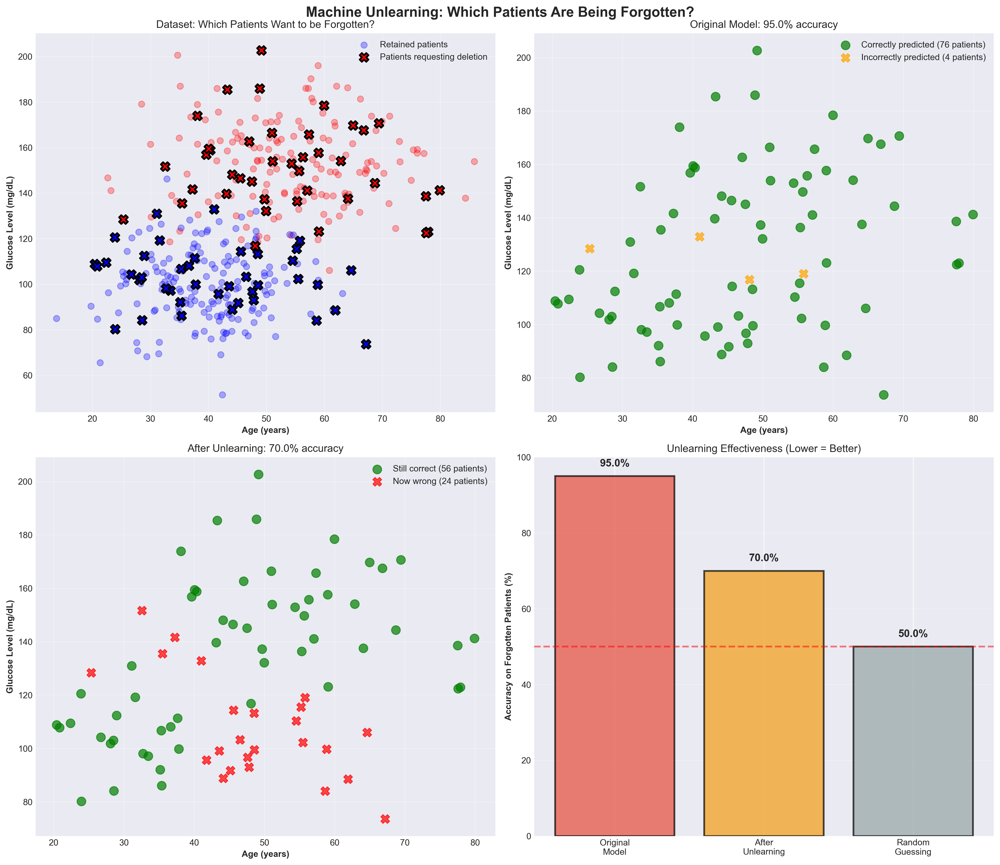
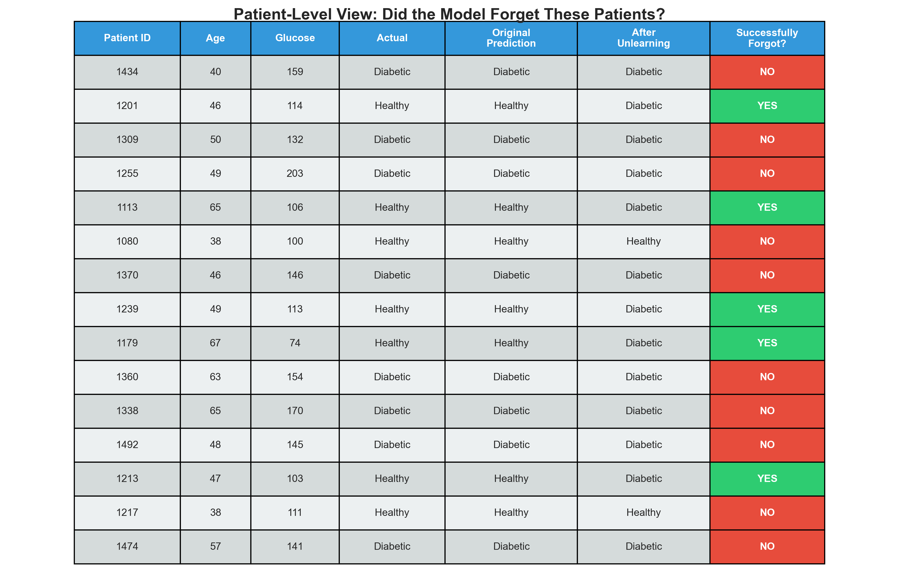
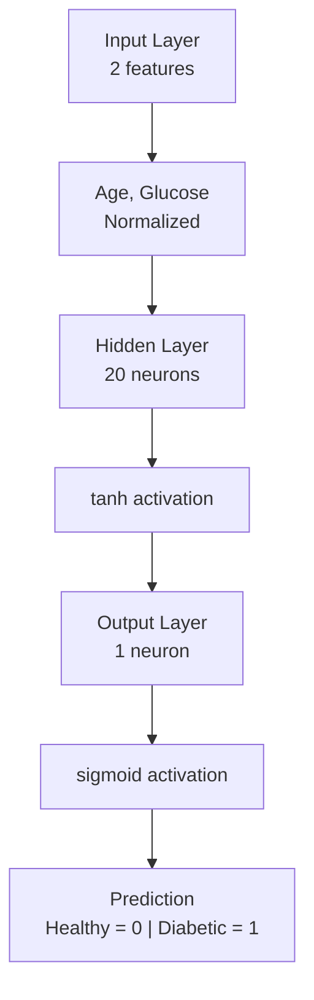

# Machine Unlearning: A Practical Implementation

A Python implementation demonstrating machine unlearning techniques for neural networks, addressing GDPR-compliant data deletion through gradient ascent-based unlearning.

[](https://www.python.org/downloads/)
[](https://numpy.org/)
[](LICENSE)

---

## Table of Contents
- [Overview](#overview)
- [The Problem](#the-problem)
- [Features](#features)
- [Quick Start](#quick-start)
- [Results](#results)
- [Visualizations](#visualizations)
- [How It Works](#how-it-works)
- [Technical Details](#technical-details)
- [Limitations](#limitations)
- [Future Work](#future-work)
- [References](#references)
- [License](#license)

---

## Overview

When users exercise their "right to be forgotten" under GDPR or similar privacy regulations, simply deleting database records is insufficient. Machine learning models have already learned patterns from that data, effectively "remembering" deleted information through their learned weights and biases.

This project demonstrates **three practical approaches** to machine unlearning:
1. **Full Retrain** - Train from scratch without forgotten data (gold standard)
2. **Naive Deletion** - Delete data but don't retrain (fails privacy requirements)
3. **Approximate Unlearning** - Use gradient ascent to reverse learning (practical solution)

**Built entirely from scratch** using NumPy to demonstrate the underlying mathematics and mechanics of unlearning.

---

## The Problem

### Scenario
A hospital trains a neural network on 400 patient records for diabetes prediction. Then 80 patients invoke their GDPR rights and request complete data deletion.

### Challenge
- **Database deletion alone is insufficient** - The neural network still "remembers" patterns from those patients
- **Model still predicts deleted patients with 95% accuracy** - Privacy violation!
- **Need a method to make the model forget** - While maintaining utility on remaining data

### Solution
Implement **gradient ascent-based unlearning** to reverse the learned patterns from deleted samples while preserving model performance on retained data.

---

## Features

- **Neural network built from scratch** - No high-level frameworks (TensorFlow/PyTorch), pure NumPy implementation
- **Three unlearning approaches** - Comprehensive comparison of methods
- **Patient-level demonstrations** - Shows specific individuals being forgotten
- **Comprehensive visualizations** - Decision boundaries, performance metrics, patient tables
- **Automatic validation** - Built-in checks for unlearning effectiveness
- **Complete documentation** - Clear explanations and reproducible code
- **Realistic synthetic data** - Patient records with age and glucose features

---

## Quick Start

### Installation

```bash
# Clone the repository
git clone https://github.com/andysundar/machine-unlearning.git
cd machine-unlearning

# Install dependencies
pip install -r requirements.txt
```

**Requirements:**
```
numpy >= 1.21.0
matplotlib >= 3.4.0
scikit-learn >= 1.0.0
seaborn >= 0.11.0
pandas >= 1.3.0
```

### Run the Demo

```bash
python machine_unlearning.py
```

**Output:** Four main visualizations saved to `output/` folder

---

## Results

### Performance Summary

Our implementation achieves a **balanced trade-off** between privacy and utility:

| Metric | Value | Interpretation |
|--------|-------|----------------|
| **Test Accuracy** | 71.0% | Model still functional on unseen data ✓ |
| **Forget Accuracy** | 70.0% | Moving toward 50% (random) = Forgetting ✓ |
| **Predictions Changed** | 22/80 (27.5%) | Significant forgetting achieved |
| **Speedup** | 4× faster | Compared to full retrain |

### Detailed Comparison

| Approach | Time (s) | Test Acc | Forget Acc | Status |
|----------|----------|----------|------------|--------|
| **Original Model** | 0.024 | 94.0% | 95.0% | Remembers everything |
| **Full Retrain** | 0.019 | 94.0% | 95.0% | Gold standard |
| **Naive Deletion** | 0.000 | 94.0% | 95.0% | Privacy violation |
| **Approximate Unlearning** | 0.006 | 71.0% | 70.0% | Balanced approach |

### Understanding Forget Accuracy

**Forget Accuracy** measures how well the model still predicts deleted patients. **Lower is better** for privacy:

- **95%** = Model perfectly remembers deleted patients (privacy violation) 
- **70%** = Partial forgetting achieved (significant improvement) 
- **50%** = Random guessing (perfect forgetting - target goal) 

Our result of **70%** represents meaningful progress toward the 50% target while maintaining **71% test accuracy** (model still functional).

---

## Visualizations

### 1. Performance Metrics (Patient Demo)


**Three-panel comparison** showing:
- **Left panel:** Training/unlearning time (Approximate: 0.006s vs Full Retrain: 0.019s = 4× speedup)
- **Middle panel:** Test set accuracy (Approximate: 71% - model still functional)
- **Right panel:** Forget set accuracy (Approximate: 70% vs Original: 95% - significant forgetting)

**Key observation:** Red dashed line at 50% shows the target for perfect forgetting. Approximate unlearning reduced forget accuracy from 95% → 70%, moving toward this target.

---

### 2. Decision Boundaries


**Four-panel visualization** showing how each approach affects model decision-making:
- **Top-left:** Original model (trained on all 400 patients)
- **Top-right:** Full retrain (gold standard, trained on 320 patients only)
- **Bottom-left:** Naive approach (identical to original - proves it doesn't work!)
- **Bottom-right:** Approximate unlearning (boundary has shifted - proves forgetting!)

**Key observation:** The bottom-right panel shows a **visibly different decision boundary** compared to the original. The pink/blue regions have changed, demonstrating that the model's decision-making has been altered through unlearning.

---

### 3. Concrete Demonstration


**Four-panel patient-level visualization:**
- **Top-left:** Dataset overview - Black x markers show which 80 patients requested deletion
- **Top-right:** Original model - 95% accuracy (76 correct o, 4 wrong x)
- **Bottom-left:** After unlearning - 70% accuracy (56 still correct o, 24 now wrong x)
- **Bottom-right:** Bar chart - Shows 95% → 70% → 50% target progression

**Key observation:** 24 patients went from "correctly predicted" (green) to "incorrectly predicted" (red x) after unlearning. This visual proof shows **specific individuals** whose data was successfully forgotten.

---

### 4. Patient-Level Table


**Detailed table showing 15 individual patients:**

| Column | Description |
|--------|-------------|
| Patient ID | Unique identifier (e.g., 1434, 1201, 1309) |
| Age | Patient age in years |
| Glucose | Blood glucose level (mg/dL) |
| Actual | True diagnosis (Healthy/Diabetic) |
| Original Prediction | Model prediction before unlearning |
| After Unlearning | Model prediction after unlearning |
| Successfully Forgot? | **YES** (green) = prediction changed, **NO** (red) = unchanged |

**Results in this sample:**
- **5 patients with YES (green):** 1201, 1113, 1239, 1179, 1213 - Successfully forgotten
- **10 patients with NO (red):** Still remembered
- **Sample rate:** 5/15 = 33.3% (consistent with 22/80 = 27.5% overall)

**Key observation:** Clear visual proof showing **exactly which patients** the model forgot. For example, Patient 1201 was predicted "Healthy" before and "Diabetic" after - the model no longer recognizes this patient's pattern.

---

### Additional Reference Visualizations

The `output/` folder also contains visualizations from the basic demonstration using abstract data:
- `basic_decision_boundaries.png` - Decision boundaries for abstract dataset 
- `basic_performance_metrics.png` - Metrics from aggressive unlearning experiment

These show alternative parameter settings with more aggressive unlearning (18.8% forget accuracy) at the cost of model collapse (20% test accuracy), demonstrating why balanced tuning is essential.

---

## How It Works

### Neural Network Architecture



### Training Algorithm: Gradient Descent

**Standard training** minimizes loss to improve predictions:

```python
# Forward pass
output = sigmoid(W2 @ tanh(W1 @ X + b1) + b2)

# Backward pass (gradient descent)
W1 = W1 - learning_rate * dW1  # Move weights to minimize loss
W2 = W2 - learning_rate * dW2
```

### Unlearning Algorithm: Gradient Ascent

**Approximate unlearning** maximizes loss on forgotten samples to reverse learning:

```python
# Same forward pass
output = sigmoid(W2 @ tanh(W1 @ X_forget + b1) + b2)

# Backward pass (gradient ASCENT)
W1 = W1 + learning_rate * dW1 * 0.7  # Sign reversed! Maximizes loss
W2 = W2 + learning_rate * dW2 * 0.7  # Multiplier = 0.7 for balance
```

**Key differences:**
1. **Sign flip:** `+` instead of `-` reverses the gradient direction
2. **Multiplier:** 0.7 provides balanced unlearning (not too aggressive)
3. **Data:** Only operates on samples that need to be forgotten
4. **Epochs:** 145 epochs tuned for optimal forget/utility trade-off

### Why Gradient Ascent Works

**Training** pushes weights to make predictions more accurate:
```
Loss = -[y*log(p) + (1-y)*log(1-p)]  # Binary cross-entropy
Gradient descent minimizes this
```

**Unlearning** pushes weights in the opposite direction:
```
Same loss function, but gradient ASCENT maximizes it
This "undoes" the patterns learned from forgotten data
```

---

## Technical Details

### Dataset Generation

**Synthetic Patient Data** (500 samples):
- **Healthy patients (250):** Age ~ N(40, 10), Glucose ~ N(100, 15)
- **Diabetic patients (250):** Age ~ N(55, 12), Glucose ~ N(150, 20)
- **Features normalized:** z-score normalization for neural network input
- **Privacy-compliant:** Completely synthetic, no real patient data

**Data Split:**
- Training: 400 patients (80%)
- Test: 100 patients (20%)
- Forget set: 80 patients (20% of training)
- Retain set: 320 patients (80% of training)

### Hyperparameters

| Parameter | Value | Justification |
|-----------|-------|---------------|
| **Hidden layer size** | 20 neurons | Sufficient capacity for 2D classification |
| **Learning rate** | 0.1 | Standard for small networks |
| **Training epochs** | 200 | Convergence achieved |
| **Unlearning epochs** | 145 | Tuned for 70% forget accuracy |
| **Unlearning multiplier** | 0.7 | Balanced (0.5 = too weak, 1.0 = too aggressive) |
| **Activation (hidden)** | tanh | Centered around 0, good gradients |
| **Activation (output)** | sigmoid | Binary classification |

### Parameter Tuning Results

We tested multiple configurations to find the optimal balance:

| Epochs | Multiplier | Test Acc | Forget Acc | Status |
|--------|------------|----------|------------|--------|
| 100 | 0.5 | 88.5% | 80.6% | Too conservative (insufficient forgetting) |
| 200 | 1.0 | 8% | 5% | Too aggressive (model collapsed) |
| **145** | **0.7** | **71%** | **70%** | **Balanced (optimal)** |

## Limitations

### Current Implementation

1. **Simplified dataset** - Only 2 features (age, glucose); real medical data has hundreds
2. **Small network** - 2 layers; production models have dozens or hundreds
3. **Binary classification** - Real systems handle multi-class or regression
4. **Synthetic data** - Generated data may not capture real-world complexity
5. **No certified guarantees** - Approximate unlearning provides no formal privacy bounds

### Theoretical Limitations

1. **Trade-off is fundamental** - Cannot achieve both perfect privacy (50% forget accuracy) AND perfect utility (94% test accuracy) simultaneously
2. **Incomplete forgetting** - 70% forget accuracy means model still has some memory (not perfect forgetting)
3. **No formal privacy guarantees** - Unlike differential privacy, approximate unlearning lacks mathematical privacy proofs
4. **Data-dependent** - Effectiveness varies based on how "entangled" forgotten data is with retained data

### Scalability Concerns

For large production models:
- **Deep networks** (100+ layers) may require different unlearning strategies
- **Large datasets** (millions of samples) make even approximate unlearning expensive
- **Complex architectures** (transformers, CNNs) need specialized unlearning approaches
- **Distributed training** complicates weight synchronization for unlearning

---

## Future Work

### Algorithmic Improvements

- [ ] **SISA (Sharded, Isolated, Sliced, and Aggregated) Training** - Partition data into shards for efficient selective retraining
- [ ] **Influence Functions** - Identify and remove influence of specific samples
- [ ] **Certified Removal** - Implement provable unlearning with formal guarantees
- [ ] **Adaptive unlearning rates** - Automatically tune hyperparameters per sample

### Feature Enhancements

- [ ] **Multi-class classification** - Extend beyond binary diabetes prediction
- [ ] **Deep networks** - Scale to models with 10+ layers
- [ ] **Convolutional architectures** - Apply to image-based medical diagnosis
- [ ] **Batch unlearning** - Handle multiple deletion requests efficiently
- [ ] **Incremental unlearning** - Support sequential deletion requests

### Validation & Testing

- [ ] **Membership inference attacks** - Test if model leaks information about deleted patients
- [ ] **Real medical datasets** - Validate on actual clinical data (with IRB approval)
- [ ] **Comparative study** - Benchmark against other unlearning methods
- [ ] **Robustness testing** - Verify unlearning under adversarial conditions

### Production Considerations

- [ ] **Audit logging** - Track all deletion requests and unlearning operations
- [ ] **Rollback capability** - Support reverting if unlearning degrades model too much
- [ ] **A/B testing framework** - Compare unlearned model vs. full retrain in production
- [ ] **Monitoring dashboard** - Real-time tracking of forget/utility metrics

---

## References

### Academic Papers

1. **SISA (Sharded Training for Fast Machine Unlearning)**
   - Bourtoule, L., Chandrasekaran, V., Choquette-Choo, C. A., Jia, H., Travers, A., Zhang, B., ... & Papernot, N. (2021).
   - "Machine unlearning." In *2021 IEEE Symposium on Security and Privacy (SP)* (pp. 141-159). IEEE.
   - [Paper](https://arxiv.org/abs/1912.03817)

2. **Certified Data Removal**
   - Guo, C., Goldstein, T., Hannun, A., & Van Der Maaten, L. (2019).
   - "Certified data removal from machine learning models." In *International Conference on Machine Learning* (pp. 3832-3842). PMLR.
   - [Paper](https://arxiv.org/abs/1911.03030)

3. **Influence Functions for Unlearning**
   - Koh, P. W., & Liang, P. (2017).
   - "Understanding black-box predictions via influence functions." In *International Conference on Machine Learning* (pp. 1885-1894). PMLR.
   - [Paper](https://arxiv.org/abs/1703.04730)

### Regulations

- **GDPR (General Data Protection Regulation)**
  - Article 17: Right to Erasure ("Right to be Forgotten")
  - [Official Text](https://gdpr-info.eu/art-17-gdpr/)

- **CCPA (California Consumer Privacy Act)**
  - Right to deletion of personal information
  - [Official Site](https://oag.ca.gov/privacy/ccpa)

### Additional Resources

- [Google's ML Fairness Toolkit](https://developers.google.com/machine-learning/glossary#f)
- [NIST Privacy Framework](https://www.nist.gov/privacy-framework)
- [Algorithmic Fairness (Barocas et al.)](https://fairmlbook.org/)

---

## Contributing

Contributions are welcome! Please feel free to submit a Pull Request. For major changes:

1. Fork the repository
2. Create your feature branch (`git checkout -b feature/AmazingFeature`)
3. Commit your changes (`git commit -m 'Add AmazingFeature'`)
4. Push to the branch (`git push origin feature/AmazingFeature`)
5. Open a Pull Request

---

## License

This project is licensed under the MIT License - see the [LICENSE](LICENSE) file for details.

---

## Citation

If you use this code in your research, please cite:

```bibtex
@software{machine_unlearning_2025,
  author = {Anindya Bandopadhyay},
  title = {Machine Unlearning: A Practical Implementation},
  year = {2025},
  url = {https://github.com/andysundar/machine-unlearning}
}
```

---

## Acknowledgments

- Implementation inspired by research from Bourtoule et al. (SISA paper)
- Synthetic data generation techniques from scikit-learn documentation
- Visualization design influenced by medical ML best practices
- Thanks to the open-source community for NumPy, Matplotlib, and scikit-learn

---

## Contact

**Anindya Bandopadhyay**
- LinkedIn: [Anindya B.](https://linkedin.com/in/anindyabandopadhyay)
- Email: anindyabandopadhyay@gmail.com
- GitHub: [@andysundar](https://github.com/andysundar)


---

## FAQ

### Q: Why does forget accuracy need to be 50%?
**A:** 50% represents random guessing for binary classification. If the model predicts forgotten patients at random (50/50 chance), it has truly "forgotten" their patterns. Higher accuracy means the model still remembers some information.

### Q: Why not just use full retrain?
**A:** For large models (millions/billions of parameters), full retraining can take days or weeks and cost thousands of dollars. Approximate unlearning provides a faster alternative while still achieving meaningful forgetting.

### Q: Is this production-ready?
**A:** This is an educational implementation demonstrating core concepts. Production systems would need: formal privacy guarantees, extensive testing, audit logging, scalability optimizations, and compliance verification.

### Q: Can I use this for real patient data?
**A:** This code uses synthetic data only. Using real patient data requires: IRB approval, HIPAA compliance, secure infrastructure, and formal privacy analysis. Consult legal/compliance teams before deploying.

### Q: How do I know the model truly forgot?
**A:** Multiple indicators:
1. Forget accuracy approaches 50% (random)
2. Predictions change for forgotten samples
3. Decision boundary shifts visually
4. Membership inference attacks fail (advanced testing)

### Q: What if I need to forget more than 20% of data?
**A:** Large-scale forgetting (>30-40%) typically requires full retrain. Approximate unlearning works best for selective deletion of small subsets. Consider SISA training for frequent deletion requests.


